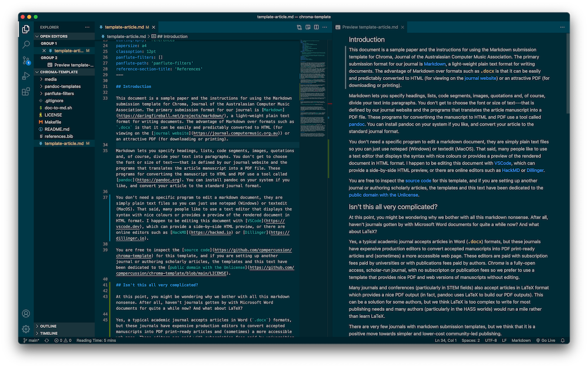
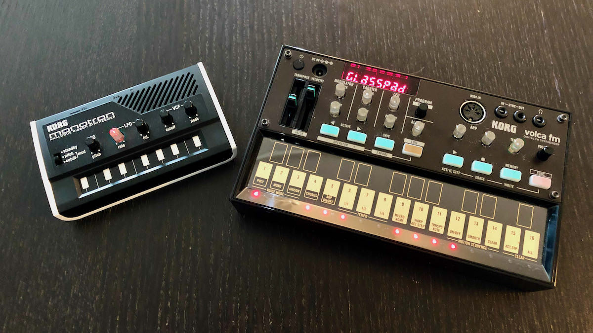

# Introduction

This document is the instructions for using the Markdown submission template for Chroma, Journal of the Australasian Computer Music Association and doubles as a sample article. The primary submission format for our journal is [Markdown](https://daringfireball.net/projects/markdown/), a light-weight plain text format for writing documents. The advantage of Markdown over formats such as `.docx` is that it can be easily and predictably converted to HTML (for viewing on the [journal website](https://journal.computermusic.org.au)) or an attractive PDF (for downloading or printing).

Markdown lets you specify headings, lists, code segments, images, quotations and, of course, divide your text into paragraphs. You don't get to choose the font or size of text---that is defined by our journal website and the programs that translates the article manuscript into a PDF file. These programs for convertinng the manuscript to HTML and PDF use a tool called [pandoc](https://pandoc.org). You can install pandoc on your system if you like, and convert your article to the standard journal format.

You don't need a specific program to edit a Markdown document, they are simply plain text files so you can just use notepad (Windows) or textedit (MacOS). That said, many people like to use a text editor that displays the syntax with nice colours or provides a preview of the rendered document in HTML format. I happen to be editing this document with [VSCode](https://vscode.dev), which can provide a side-by-side HTML preview, or there are online editors such as [HackMD](https://hackmd.io) or [Dillinger](https://dillinger.io).



You are free to inspect the [source code](https://github.com/cpmpercussion/chroma-template) for this template, and if you are setting up another journal or authoring scholarly articles, the templates and this text are licensed under a [Creative Commons Zero v1.0 Universal](https://github.com/cpmpercussion/chroma-template/blob/main/LICENSE) license.

## Isn't this all very complicated?

At this point, you might be wondering why we bother with all this Markdown nonsense. After all, haven't journals gotten by with Microsoft Word documents for quite a while now? And what about LaTeX?

Yes, a typical academic journal accepts articles in Word (`.docx`) formats, but these journals have production editors to convert accepted manuscripts into PDF print-ready articles and (sometimes) a more accessible web page. These editors are paid with subscription fees paid by universities or with publications fees paid by authors. _Chroma_ is a fully-open access, scholar-run journal, with no subscripton or publication fees so we prefer to use a template that provides nice PDF and web versions of manuscripts without editing. 

Many journals and conferences (particularly in STEM fields) accept articles in LaTeX format which provides a nice PDF output (in fact, pandoc uses LaTeX to build our PDF outputs). This can be a solution for some authors, but  many others authors would run a mile rather than learn LaTeX so other solutions are needed.

There are very few academic journals or conferences with Markdown submission templates, but we think that it is a positive move towards simpler and lower-cost community-led publishing.

# Syntax

We cover a brief explanation of the main syntax features below, but more in-depth documentation can be found at [CommonMark](https://commonmark.org/help/).

You can write section headings in your article by typing `#`, which corresponds to "Heading 1" in Word or `\section{}` in LaTeX. Sub-sections can be produced with `##` and so on.

You can use produce emphasised text with underscores `_italics_`, using bold text is possible, but not considered good style.

You can include inline code with backticks, e.g., `` `code` `` produces `code`. For a longer code block, start and finish it with three backticks (`` ``` ``), e.g.:

```{caption="Here's a caption for the code snippet" .scheme} 
(bind-func sine:DSP
  (lambda (in time chan dat)
    (* .1 (cos (* (convert time) .04)))))
```

You can type the language name straight after the opening backticks to enable syntax highlighting.

You can include hyperlinks like so: `[link text](https://computermusic.org.au)`.

Footnotes are referenced with a caret symbol (`[^1]`) (see [pandoc manual](https://pandoc.org/MANUAL.html#footnotes)) for instance:
```markdown
Here's a sentence[^1].

[^1]: And here's the footnote.
```
Which looks like this: Here's a sentence[^1].

[^1]: And here's the footnote.

Numbered and un-numbered lists are very easy, just use `-` to indicate unnumered list items, and numbers, e.g., `1.` to indicate numbered list items.

## Figures and Tables

The syntax for including an image is similar to a link but with an exclamation point before the first bracket. The text inside the square brackets is interpreted as the figure caption. For example:
```

```


Tables follow the markdown table syntax, which uses a lot of `|` and `-` symbols. The table caption goes after a `:` symbol just after the table. This syntax is specific to [pandoc](https://pandoc.org/MANUAL.html#tables).

| Instrument | Keys | Strings | Antennae |
|------------|------|---------|----------|
| Piano      | 88   | 230     | 0        |
| Guitar     | 0    | 6       | 0        |
| Theremin   | 0    | 0       | 2        |
| Trumpet    | 3    | 0       | 0        |
Table: A table of musical instrument configurations

The LaTeX template for that generates the PDF files tends to "float" figures and tables, so they may not end up _precisely_ where put in text. It's usually better just to let this happen and not try to override it.

# Citations

Citations are supported in Markdown and pandoc (see documentation [here](https://pandoc.org/MANUAL.html#citations)).  In this template, the references are listed in `references.bib` in BibTeX format. Citations look like `[@foo]` where `foo` is the id of the BibTeX entry.

Here's one example [@Collins:2008fr]. Some other sources include [@Fiebrink:2007cz], and [@Roads:1996ve]. Complex citations are possible too [e.g., @Worrall:1999kl, pp. 33-35; also @Collins:2008fr, ch. 1].

This template includes a style file, `apa.csl`, to define the APA style we use in _Chroma_.

You can also just type citations manually into the markdown file, and if the manuscript has been received as a Word document and converted to markdown, the references will be manually entered. In this case, add a section (`# References`) at the end of the document with the references after that. It's a good idea to add a _little_ bit of manual LaTeX code to make the references look right with hanging indents:

    # References
    
    ```{=latex}
    \begin{hangparas}{1.5em}{1}
    ```
    
    Worrall, D. (1999). Cyberspace and sound. Proceedings of the Australasian Computer Music Conference.
    
    (other references)
    
    ```{=latex}
    \end{hangparas}
    ```


# Header block

The strange looking section of text at the start of this file contains the metadata which produces the title, authors, abstract and some other details for your article. It's in a format called [yaml](https://yaml.org) which is supposed to be human-friendly but is sometimes tricky to get right. A minimal article example would have:

```yaml
---
title: 'Article Title'
date: '2021-01-01'
anonymous: 'false'
author: 
    - name: Author Name
      affiliation: Author Affiliation
      city: City
      country: Country
      email: author.name@email.com
author-header: A. Name (short version of author name)
abstract: |
    Article abstract
bibliography: 'references'
papersize: a4
classoption: 12pt
reference-section-title: 'References'
---
```
This section is set up this way to work with pandoc which expects the YAML metadata to be in this specific format (see the [pandoc manual](https://pandoc.org/MANUAL.html#extension-yaml_metadata_block)).

Some Markdown preview software knows what to do with the YAML metadata, some will ignore it, and some will just print it out as if it is normal text, so if it doesn't appear correctly in your text editor that may not be a problem.

# Conclusions

Writing articles in Markdown can be a breath of fresh air compared to traditional word processors, but there can be some frustrations in terms of installing special software (e.g., pandoc) and in configuring the templates to create the right kind of outputs.

Here's few things we haven't explained here but might in future:

- lists (just like this one)
- figure and section references
- including LaTeX maths
- how to convert from docx to markdown

This is a living document and it is hoped that any authors (such as you!) who try it out might provide feedback (e.g., you could make an [issue on the template repository](https://github.com/cpmpercussion/chroma-template/issues)) and help us to improve this template for future authors and potentially other publications.
