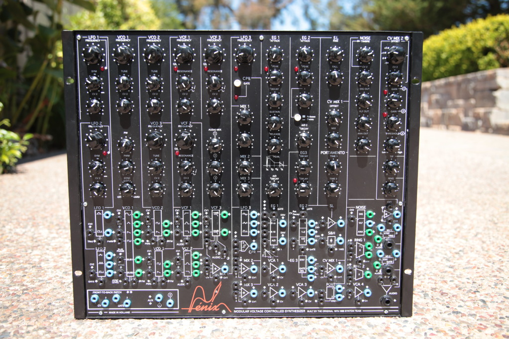
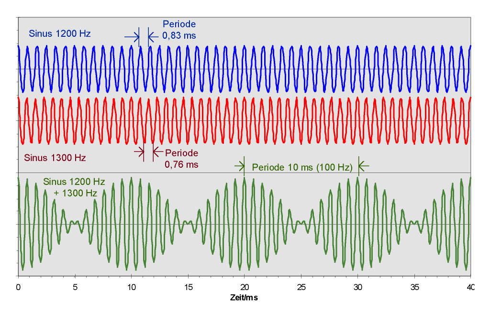

# Introduction

Lorem ipsum dolor sit amet, consectetur adipiscing elit. Nulla efficitur justo vel tortor gravida, pellentesque hendrerit arcu mollis. Phasellus iaculis facilisis tellus, sed lacinia sapien varius gravida. Donec a ipsum gravida, aliquam nulla eu, gravida risus. Phasellus et pellentesque odio. Nulla fermentum erat id aliquet iaculis. Suspendisse cursus consequat maximus. Vivamus vitae eros nisi. Duis sollicitudin diam ac eros tristique, a efficitur lectus laoreet. Aenean et sodales urna. In sollicitudin non erat ut sollicitudin. Nullam vulputate rhoncus sem, a interdum nibh mattis egestas.

Sed eu dapibus arcu. Nunc laoreet erat fermentum pharetra suscipit. Suspendisse ut orci at augue volutpat ultricies quis ullamcorper ipsum. Proin semper tellus eget tincidunt pretium. Praesent dolor velit, condimentum a placerat non, finibus bibendum eros. Integer vitae vehicula erat, eget commodo massa. Nullam non nibh sed elit tempus efficitur volutpat sit amet nibh.

Here's a few references to check that everything is working. First article [@Collins:2008fr], second [@Fiebrink:2007cz], third [@Roads:1996ve], and fourth [@Worrall:1999kl].

# Results

Nullam quam felis, vehicula id leo sed, fringilla faucibus dui. Mauris vulputate aliquam eros et faucibus. Curabitur laoreet ultrices maximus. Quisque non finibus dui, eget eleifend magna. Cras consectetur auctor suscipit. Sed ac elit ac massa luctus bibendum quis vel felis. Curabitur vehicula risus ut tincidunt tincidunt. Suspendisse pretium, ligula mollis maximus tempor, nisi urna volutpat ipsum, vel aliquam est purus a dolor. Mauris scelerisque in neque ac sodales. Nullam ac purus felis. Integer tristique aliquam justo at venenatis. Phasellus odio nulla, hendrerit eu dictum eu, pellentesque quis dolor. Nullam dapibus lobortis luctus. Vivamus eu tortor orci.

Sed ligula nunc, faucibus quis bibendum at, elementum eget erat. Sed ac odio sed turpis blandit tempor. Sed dapibus eget nunc ac mattis. Proin nunc libero, posuere ultricies velit vitae, molestie finibus urna. In odio nisi, volutpat at blandit quis, scelerisque eget ligula. Maecenas fermentum quis odio vel luctus. Maecenas sit amet suscipit odio. Morbi eget viverra quam, et tempus mauris. Quisque ut sem id nibh ultricies consequat. Cras aliquet ligula leo. Duis id libero id mauris facilisis accumsan. Vestibulum at sapien quis lacus pellentesque ultrices a id nibh. Nam eget purus consequat metus rhoncus dapibus. Aenean in pretium felis.

# Conclusion

Etiam non volutpat lectus, id accumsan turpis. Duis tincidunt leo orci, facilisis eleifend enim pellentesque vitae. Duis cursus sapien tincidunt metus maximus, a pellentesque eros tincidunt. Donec sed tristique ex. Morbi venenatis consectetur diam, eu aliquam felis congue nec. Maecenas maximus arcu nibh, nec tempus turpis maximus id. Vestibulum vitae porta sapien.
