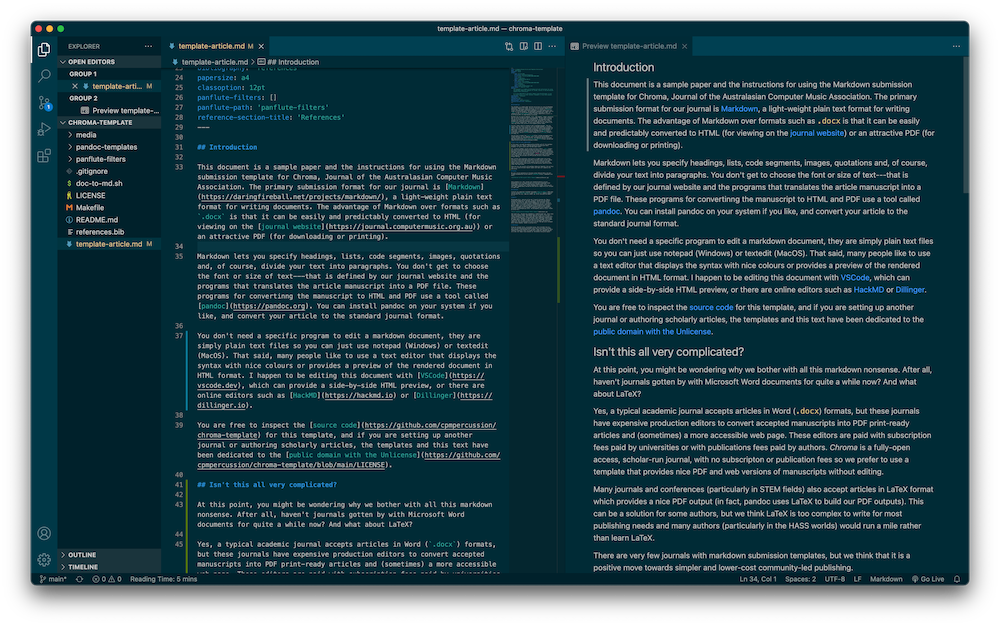

## Introduction

This document is a sample paper and the instructions for using the Markdown submission template for Chroma, Journal of the Australasian Computer Music Association. The primary submission format for our journal is [Markdown](https://daringfireball.net/projects/markdown/), a light-weight plain text format for writing documents. The advantage of Markdown over formats such as `.docx` is that it can be easily and predictably converted to HTML (for viewing on the [journal website](https://journal.computermusic.org.au)) or an attractive PDF (for downloading or printing).

Markdown lets you specify headings, lists, code segments, images, quotations and, of course, divide your text into paragraphs. You don't get to choose the font or size of text---that is defined by our journal website and the programs that translates the article manuscript into a PDF file. These programs for convertinng the manuscript to HTML and PDF use a tool called [pandoc](https://pandoc.org). You can install pandoc on your system if you like, and convert your article to the standard journal format.

You don't need a specific program to edit a markdown document, they are simply plain text files so you can just use notepad (Windows) or textedit (MacOS). That said, many people like to use a text editor that displays the syntax with nice colours or provides a preview of the rendered document in HTML format. I happen to be editing this document with [VSCode](https://vscode.dev), which can provide a side-by-side HTML preview, or there are online editors such as [HackMD](https://hackmd.io) or [Dillinger](https://dillinger.io).



You are free to inspect the [source code](https://github.com/cpmpercussion/chroma-template) for this template, and if you are setting up another journal or authoring scholarly articles, the templates and this text have been dedicated to the [public domain with the Unlicense](https://github.com/cpmpercussion/chroma-template/blob/main/LICENSE).

## Isn't this all very complicated?

At this point, you might be wondering why we bother with all this markdown nonsense. After all, haven't journals gotten by with Microsoft Word documents for quite a while now? And what about LaTeX?

Yes, a typical academic journal accepts articles in Word (`.docx`) formats, but these journals have production editors to convert accepted manuscripts into PDF print-ready articles and (sometimes) a more accessible web page. These editors are paid with subscription fees paid by universities or with publications fees paid by authors. _Chroma_ is a fully-open access, scholar-run journal, with no subscripton or publication fees so we prefer to use a template that provides nice PDF and web versions of manuscripts without editing. 

Many journals and conferences (particularly in STEM fields) accept articles in LaTeX format which provides a nice PDF output (in fact, pandoc uses LaTeX to build our PDF outputs). This can be a solution for some authors, but  many others authors would run a mile rather than learn LaTeX so other solutions are needed.

There are very few academic journals or conferences with markdown submission templates, but we think that it is a positive move towards simpler and lower-cost community-led publishing.

## Syntax

We cover a brief explanation of the main syntax features below, but more in-depth documentation can be found at [CommonMark](https://commonmark.org/help/).

You can write section headings in your article by typing `##`, which corresponds to "Heading 2" in word or `\section{}` in LaTeX. Sub-sections can be produced with `###` and so on.

You can use produce emphasised text with underscores `_italics_`, using bold text is possible, but not considered good style.

You can include inline code with backticks, e.g., `` `code` `` produces `code`. For a longer code block, start and finish it with three backticks (`` ``` ``), e.g.:

```
(bind-func sine:DSP
  (lambda (in time chan dat)
    (* .1 (cos (* (convert time) .04)))))
```

You can include hyperlinks like so: `[link text](https://computermusic.org.au)`.

The syntax for including an image is similar but with an exclamation point before the first bracket, e.g.: 
```

```


For images, the text inside the square brackets is interpreted as the figure caption. 

## Citations

Citations are supported in markdown and pandoc [@Collins:2008fr]. Some other sources include [@Fiebrink:2007cz], and [@Roads:1996ve]. Complex citations are possible too [e.g., @Worrall:1999kl, pp. 33-35; also @Collins:2008fr, ch. 1].

## Header block

The strange looking section of text at the start of this file contains the metadata which produces the title, authors, abstract and some other details for your article. It's in a format called [yaml](https://yaml.org) which is supposed to be human-friendly but is sometimes tricky to get right. A minimal article example would have:
```
---
title: 'Article Title'
date: '2021-01-01'
anonymous: 'false'
author: 
    - name: Author Name
      affiliation: Author Affiliation
      city: City
      country: Country
      email: author.name@email.com
author-header: A. Name (short version of author name)
abstract: |
    Article abstract
bibliography: 'references'
papersize: a4
classoption: 12pt
panflute-filters: []
panflute-path: 'panflute-filters'
reference-section-title: 'References'
---
```
This section is set up this way to work with pandoc which expects the YAML metadata to be in this specific format (see the [pandoc manual](https://pandoc.org/MANUAL.html#extension-yaml_metadata_block)).

Some Markdown preview software knows what to do with the YAML metadata, some will ignore it, and some will just print it out as if it is normal text, so if it doesn't appear correctly in your text editor that may not be a problem.

# Results

Nullam quam felis, vehicula id leo sed, fringilla faucibus dui. Mauris vulputate aliquam eros et faucibus. Curabitur laoreet ultrices maximus. Quisque non finibus dui, eget eleifend magna. Cras consectetur auctor suscipit. Sed ac elit ac massa luctus bibendum quis vel felis. Curabitur vehicula risus ut tincidunt tincidunt. Suspendisse pretium, ligula mollis maximus tempor, nisi urna volutpat ipsum, vel aliquam est purus a dolor. Mauris scelerisque in neque ac sodales. Nullam ac purus felis. Integer tristique aliquam justo at venenatis. Phasellus odio nulla, hendrerit eu dictum eu, pellentesque quis dolor. Nullam dapibus lobortis luctus. Vivamus eu tortor orci.


Sed ligula nunc, faucibus quis bibendum at, elementum eget erat. Sed ac odio sed turpis blandit tempor. Sed dapibus eget nunc ac mattis. Proin nunc libero, posuere ultricies velit vitae, molestie finibus urna. In odio nisi, volutpat at blandit quis, scelerisque eget ligula. Maecenas fermentum quis odio vel luctus. Maecenas sit amet suscipit odio. Morbi eget viverra quam, et tempus mauris. Quisque ut sem id nibh ultricies consequat. Cras aliquet ligula leo. Duis id libero id mauris facilisis accumsan. Vestibulum at sapien quis lacus pellentesque ultrices a id nibh. Nam eget purus consequat metus rhoncus dapibus. Aenean in pretium felis.

# Conclusion

Etiam non volutpat lectus, id accumsan turpis. Duis tincidunt leo orci, facilisis eleifend enim pellentesque vitae. Duis cursus sapien tincidunt metus maximus, a pellentesque eros tincidunt. Donec sed tristique ex. Morbi venenatis consectetur diam, eu aliquam felis congue nec. Maecenas maximus arcu nibh, nec tempus turpis maximus id. Vestibulum vitae porta sapien.
